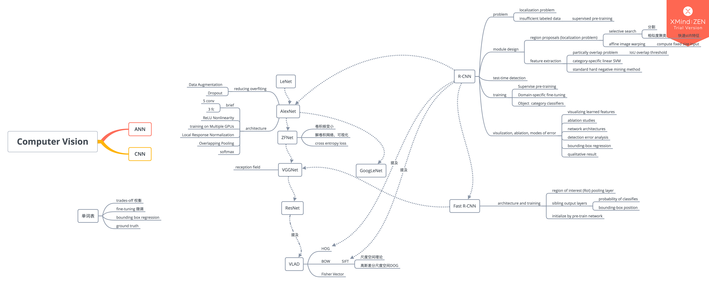

# 深度学习总结(1)

## 一、基础概念学习

### 1. 感知机

#### 1.1 感知机模型

> $f(x) = sign(w\cdot x+b)$

简单判别模型，输出为正负号

#### 1.2 感知机学习策略

> 通过第一范式或第二范式等形式

如第二范式损失函数（残差平方和）：$L(f) =\sum (f(x_i) - y_i)^2 =\sum (\hat {y_i}- y_i)^2$ 

模型的损失函数越低，说明模型越好

#### 1.3 感知机学习算法

##### 1.3.1 梯度的概念

> 即为某函数$F(x_1, x_2, …, x_n)$ 对各个变量求导后得到的向量$\overrightarrow v = [\frac {dF} {dx_1}, \frac {dF} {dx_2}, \frac {dF} {dx_3}, ….. \frac {dF} {dx_n}]$
>
> 方向代表F在点$[x_1, x_2, … x_n]$ 指向F斜率最大的方向（F变大的方向）

##### 1.3.2 梯度下降法

> 为了计算最小化损失函数，即为位于$L$的偏导为零的极小值（假设$L$是可导函数）

1. 通过解析解求极值

使得偏导数为零，列方程组解方程，矩阵方程组求解（计算量大，容易失去精度）

1. 通过数值解求极值

通过迭代更新规则$w = w + \eta \cdot \nabla w$， $b = b + \eta \cdot \nabla b $ 

$\nabla w, \nabla b$ 为梯度，$\eta $ 为学习率

> 注意sign不可导

### 2. 多层感知网络/人工神经网络（ANN）

> 多层感知机，中将多个感知机单元按照层与层的关系连接输入输出，使得数据在网络中的传输方向是不断向前的，也叫做前向网络；由于类似脑中的神经元拓扑结构，也叫人工神经网络

#### 2.1 激励函数

> 激励函数为模型添加非线性化

多层网络中对感知机做出了改进，激励函数改用一个S型函数（sigmoid），$S(x) = \frac 1 {1 + e^{-x}}$，解决$sign(x)$不可导的问题，

#### 2.2 网络结构

> 一层由多个感知机单元组成，上一层结构的所有感知机的输出将输入当前层每个神经元
>
> 即为每个神经元需要以上一层所有神经元的输出作为输入，所以也就全连接

输入层+隐藏层+输出层

> 对于多分类问题，可能结尾会需要使用一个softmax函数转换为概率分布

#### 2.3 反向传播算法

由于出现了多层网络，就出现一个问题，原来的梯度下降法是否用于模型的优化呢？

答案是可以的，在BP的论文中给予了证明，即通过**链式法则**求各层各个参数的偏导数。

- BP的核心指出，在网络中下一层的得到的梯度，可以在上一层梯度计算的过程中使用，所以各层的梯度计算是一个递推的过程，所以每层的时间复杂度都是相同的，指出多层网络中的梯度计算是可行的

> 由于梯度的计算是从网络的输出层计算到输入层，与前向网络的方向（输入层到输出层）相反，同时由于梯度的计算是层次相关的，类似传播的过程，所以叫做反向传播算法

### 3. 卷积神经网络（CNN）

> 与ANN不同，引入卷积概念，池化概念，ReLU概念

#### 3.1 卷积的概念

- feature map：指数据的形式
- feature map size：$c \times w \times h$ (频道(channel) x 宽 x 高)

- kernel/mask：卷积核指的是一个三维的张量
- kernel size：$d\times w \times h$ （深度 x 宽 x 高）
- receptive field: 一个kernel与feature map一次卷积的feature map的范围（一次卷积只能用一部分feature map，计算得到一个值）

- padding：原始feature map卷积前的边缘扩充
- stride：kernel卷积中移动的距离
- convolution：通过卷积核在原feature map上各个感知域（receptive field）点乘求和操作，提取feature map的特征

> convolution 使用的是

#### 3.2 池化的概念

- 最大池化
- 平均池化

> pooling 是一种下取样的方法，目的是为了降低feature map的尺度

#### 3.3 用ReLU代替激励函数sigmoid

AlexNet中提出，效果得到优化

> 相当于去了个绝对值，同样是非线性，在x = 0处不可导

#### 3.4 网络结构

与ANN一样是：输入层+隐藏层+输出层

不同于加入了卷积层，池化层，ReLU方法。

卷积层一般紧接池化层

## 二、代表架构学习

> 代表架构的学习让我学到了除网络结构以外的东西
>
> 1. 一些数据预处理的方法，如AlexNet中数据增强
> 2. 解决过拟合的方法，如Dropout，LRN（local response normalization）
> 3. 各种新型网络的结构，以及好的CNN模型的特点（深、窄）
> 4. CNN模型的可适用领域广泛，各种解决各种其他实际问题
> 5. 了解了一些有趣的算法，selective searching

- RoadMap

### LeNet

1. 首次提出卷积网络应用于人工神经网络
2. 提出池化层的概念

### AlexNet

1. 改进池化层，使用最大化池
2. 使用ReLU代替sigmoid
3. 为了防止过拟合，提出Dropout，Data Augmentation
4. 提出LNR（local response nomarlization）
5. 运用GPU的并行运算的性能

### ZFNet

1. 对AlexNet提出可视化层面研究，研究CNN背后机理
2. 提出解卷积层，可视化CNN学习的过程
3. 减小AlexNet部分卷积核，减少参数得到更好效果

### VGG

1. 研究CNN不同模型的性能，提出更深的网络以及更小的卷积核的改进思路
2. 提出3x3卷积核，简化模型，使得需要训练的参数更少
3. feature map随着尺寸变小，逐渐加深层数

### GoogLeNet

1. 提出了Inception module
2. Inception module中运用许多并行结构
3. 参量减少更多
4. 可以运用于图像检测

### ResNet

1. 为解决层数太多，梯度消失的问题，提出残差模型

------

> 下面是关于图像检测的模型，许多只是在粗略的学习

### R-CNN

1. 第一阶段通过selective searching 算法进行Region Proposal 区域预选，每个图片提取2000个regions
2. 第二阶段通过CNN提取每个region的特征
3. 第三阶段通过SVM线性分类器，对每个region的类型进行识别，同时设置阈值，去除无信息regions
4. 后期做box-bounding regression 使得提取区域的边界更为准确

### Fast R-CNN

1. 保留selective searching
2. 将SVM部分去除
3. 提出RoI，以及RoI池化层，用于训练box bounding
4. CNN改造成两个部分，一个部分用来训练分类，一个用于训练box bounding
5. 一定程度上增强了CNN网络的作用，以及简化了模型

## 三、工程学习

### Tensorflow

- 搭建LeNet的简化模型，训练手写体，在测试集中达到超过94%的正确率
- 下阶段打算尝试搭建VGG，ResNet，训练相片分类，熟悉网络的搭建

### Pytorch

未实践

——未完待续

