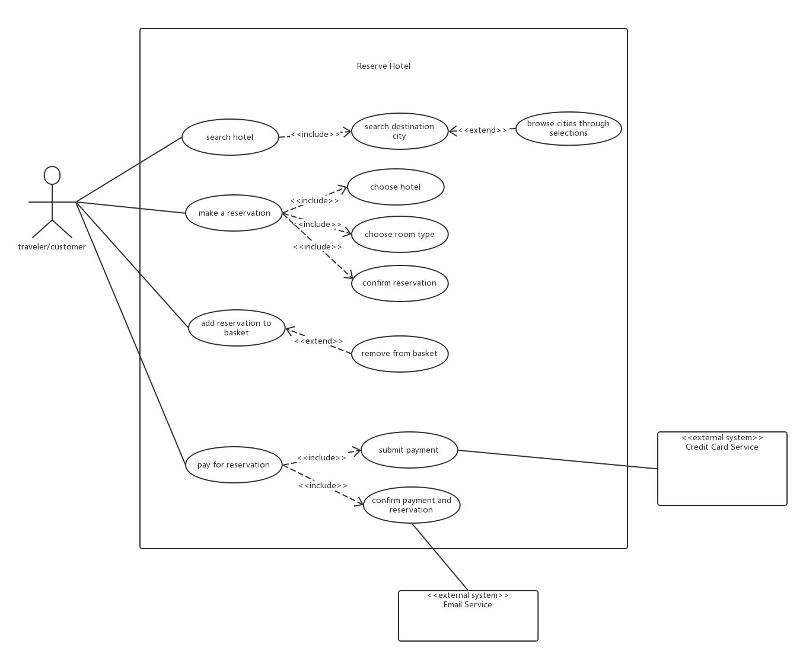
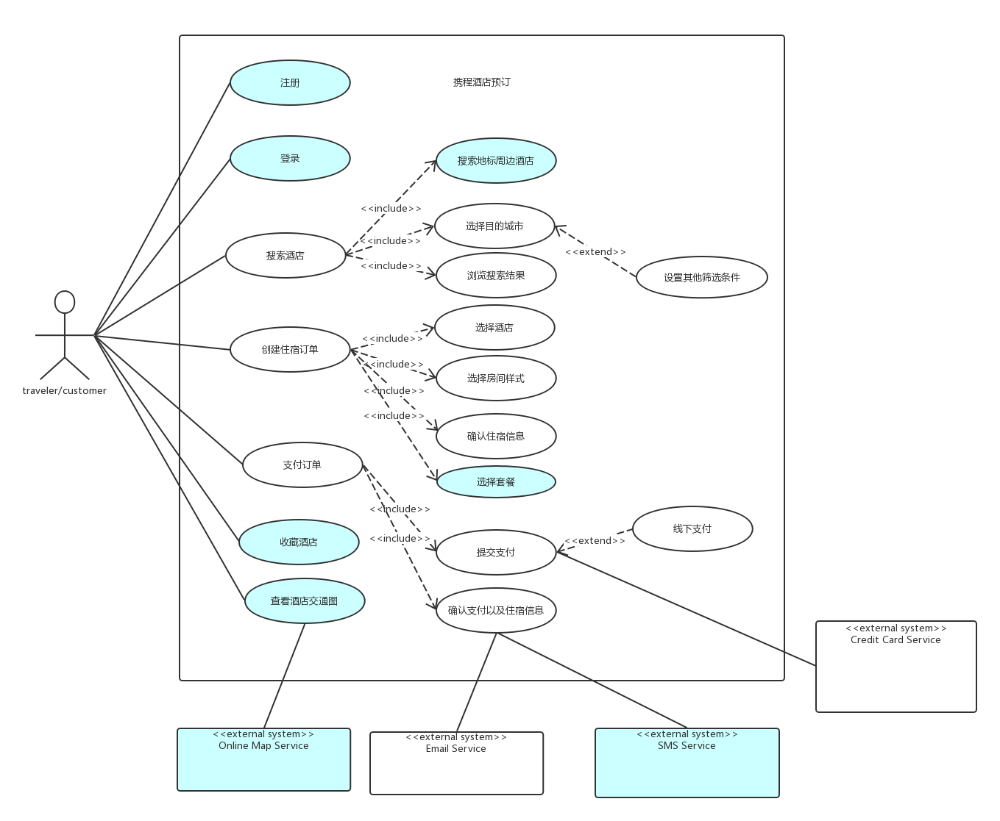
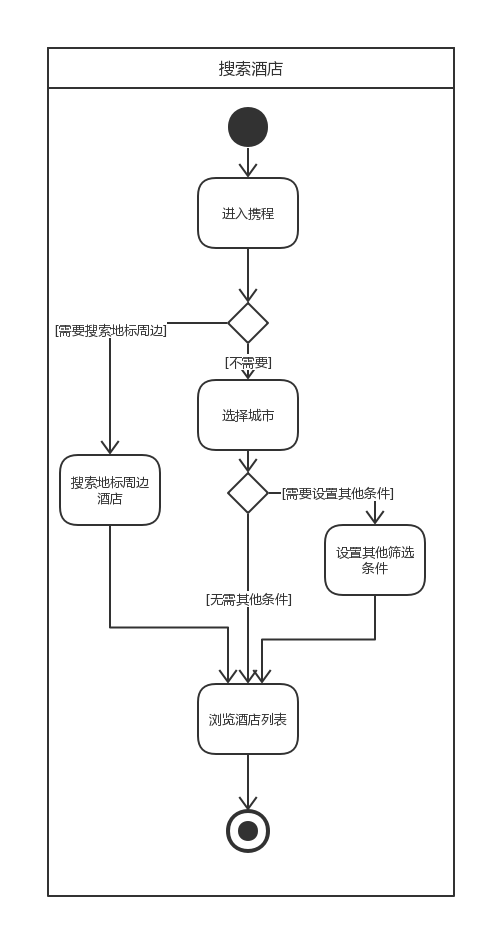
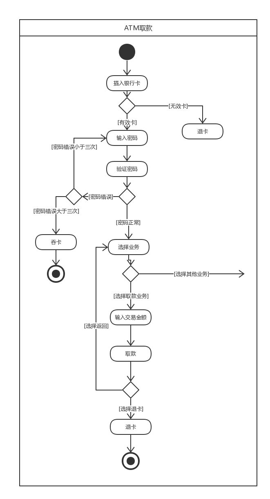
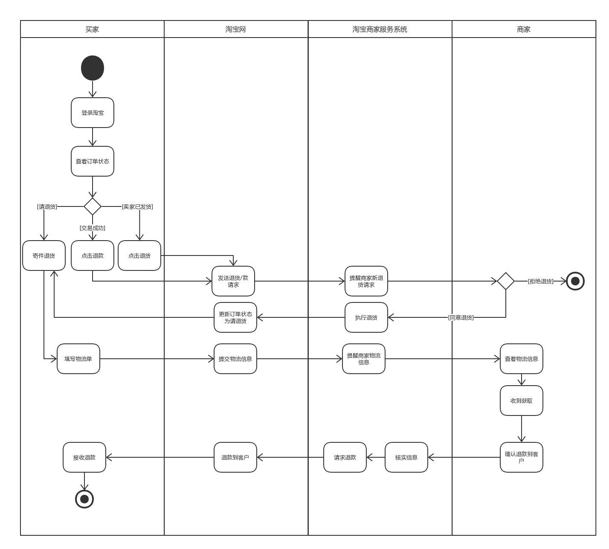

## 1. 团队作业

- [项目Dashboard](https://github.com/Zhidan-System/Dashboard)

- [软件规格说明书（含用例）](https://github.com/Zhidan-System/Dashboard/blob/master/docs/Inception/Software-Requirement-Specification.md)

## 2. 个人作业

### 2.1 用例建模

> 用例( Use Case )是一种描述产品需求的方法，使用用例的方法来描述产品需求的过程就是用例模型，用例模型是由用例图和每一个用例的详细描述文档所组成的。
>
> 用例建模是UML建模的一部分，它也是UML里最基础的部分。用例建模的最主要功能就是用来表达系统的功能性需求或行为。用例图重点描述用户需求。 它描述需求、用户和主要组件之间的关系。 

a. 阅读 Asg_RH 文档，绘制用例图。 按 Task1 要求，请使用工具 UMLet，截图格式务必是 png 并控制尺寸

b. 选择你熟悉的定旅馆在线服务系统（或移动 APP），如绘制用例图。并满足以下要求：

- 对比 Asg_RH 用例图，请用色彩标注出创新用例或子用例
- 尽可能识别外部系统，并用色彩标注新的外部系统和服务

c. 对比两个时代、不同地区产品的用例图，总结在项目早期，发现创新的思路与方法

| 相同用例/系统                                                | 不同用用例/系统                                              |
| ------------------------------------------------------------ | ------------------------------------------------------------ |
| 1. 搜索酒店 2. 预订住房 3. 支付 4. 取消订单 5. 输入筛选条件 6. 选择房间 7. 提交订单 8. 确认订单信息 | 1. 短信系统 2. 交通地图系统 3. 搜索地标周边酒店 4. 查看酒店交通地图 5. 收藏酒店 6. 线下支付 7. 选择套餐 |

创新思路和方法：

1. 将服务打包化，类似套餐之类的服务集合，减少部分用例，体验更好
2. 考虑实际中客户可能面对的问题，尽可能在一个app中提供解决方法（如：交通路线图）
3. 对于支付方式，应该提供更多的选择
4. 在原有的用例图基础上，添加创新性子用例，添加创新性父用例

d. 请使用 SCRUM 方法，在（任务b）用例图基础上，编制某定旅馆开发的需求 （backlog 产品特性）

> `SCRUM`：敏捷开发
>
> `backlog`：产品backlog由所有的功能特性，包括业务功能，非业务功能（技术、架构和工程实践相关），提升点以及缺陷的修复等组成。这些内容也是将来产品版本发布的主要内容。
> 一个完整的backlog是一个的蓝图，可以根据它来把产品改造成为我们期望的样子。 但是在Scrum中，Backlog是根据产品和产品使用环境的演化而不断演化的。所以Backlog是动态的，我们会持续的改变它去确保我们的产品是最合理的，最有竞争力的，最有价值的。 
>
> 当我们去看产品的backlog的时候，优先级是一个重要的视角，优先级越高的backlog需要越清晰，越详细。对于优先级低的backlog，详细程度会越低，直到几乎我们不能认为它是一个backlog项（非常低的优先级，只相当于一个占位符，来用做提醒）。
>
> `backlog`列表包含以下字段
>
> **ID** 是统一的标识符，自增的数字
>
> **名称** 是简短的、描述性的需求(故事、特性)名；它必须要含义明确，这样开发人员和产品负责人才能大致明白是什么东西，以跟其他需求(故事、特性)区分开。
>
> **估算** 对每个backlog项做估算（包括成本，复杂度，风险，功能点）。优先级越高的Backlog估算要越精确，在估算的过程中可能会导致backlog的优先顺序有可能随之发生变化（对于那些很重要，并且可以快速解决的问题可以先做）。 我们要经常做估算。
>
> **优先顺序（重要性）**每个backlog项都有优先级，这些backlog项按照优先次序排行队列放在backlog列表中。在评估的过程中
>
> **如何演示** 指大致描述一下在验收时，如何才能进行演示，本质就是一个简单的测试规范
>
> **注释** 指相关信息、解释说明和对其它资料的引用等等。一般都非常简短或没有。

| ID   | Name               | Est  | Imp  | How to do demo                                               | Note |
| ---- | ------------------ | ---- | ---- | ------------------------------------------------------------ | ---- |
| 1    | 创建住宿订单       | 100  | 10   | demo1: 选择酒店，选择日期房间，选择入住人数，最后确认订单; demo2: 取消最后订单 | 无   |
| 2    | 支付住宿订单       | 100  | 10   | demo1: 点击支付，在第三方支付界面确认支付，支付成功； demo2: 取消支付 | 无   |
| 3    | 搜索酒店           | 80   | 10   | demo1: 点击搜索框，输入酒店名 demo2: 点击地标，搜索地标附近酒店 demo3: 选择城市，搜索酒店 demo4: 选择筛选条件，搜索酒店 | 无   |
| 4    | 收藏酒店           | 50   | 2    | demo1: 进入酒店信息界面，点击收藏酒店                        | 无   |
| 5    | 查看酒店交通路线图 | 50   | 10   | demo1: 进入酒店信息界面，点击附近交通路线图                  |      |
| 6    | 注册               | 50   | 2    | demo1: 点击注册，输入注册信息，确认注册                      | 无   |
| 7    | 登录               | 50   | 2    | demo1: 输入账户密码，点击登录                                | 无   |

### 2.2 业务建模

> **业务建模**是指对商业（或非商业）组织及其运作的[流程](http://wiki.mbalib.com/wiki/%E6%B5%81%E7%A8%8B)进行的建模过程。
>
> wiki: **业务流程模型和标记法**（**BPMN**, **Business Process Model and Notation**）[[译注1\]](https://zh.wikipedia.org/wiki/%E4%B8%9A%E5%8A%A1%E6%B5%81%E7%A8%8B%E6%A8%A1%E5%9E%8B%E5%92%8C%E6%A0%87%E8%AE%B0%E6%B3%95#endnote_%E8%AF%91%E6%B3%A81a)是[工作流](https://zh.wikipedia.org/wiki/%E5%B7%A5%E4%BD%9C%E6%B5%81)中特定[业务流程](https://zh.wikipedia.org/wiki/%E4%B8%9A%E5%8A%A1%E6%B5%81%E7%A8%8B)的[图形化表示法](https://zh.wikipedia.org/wiki/%E4%BF%A1%E6%81%AF%E5%8F%AF%E8%A7%86%E5%8C%96)。
>
> BPMN有以下4个基本元素：
>
> 1. 流对象（Flow Objects）：包括事件、活动、网关，是BPMN中的核心元素；
> 2. 连接对象（Connecting Objects）：包括顺序流、消息流、关联；
> 3. 泳道（Swimlanes）：包括池和道两种类型；
> 4. 人工信息（Artifacts）：包括数据对象、组、注释

a. 在（任务b）基础上，用活动图建模找酒店用例。简述利用流程图发现子用例的方法。

- 这里我对对创建住宿订单进行业务建模

寻找子用例的方法：

1. 在每个控制流处尝试添加“是否xxx”的条件选择，以为活动图添加创新用例活动
2. 为每个控制流中间过程做细分，尝试能否分的更细更多的子活动

b. 选择你身边的银行 ATM，用活动图描绘取款业务流程

c. 查找淘宝退货业务官方文档，使用多泳道图，表达客户、淘宝网、淘宝商家服务系统、商家等用户和系统协同完成退货业务的过程。分析客户要完成退货业务，在淘宝网上需要实现哪些系统用例

### 2.3 用例文本编写

> 用例文本三种形式：brief、casual、full

在大作业基础上，分析三种用例文本的优点和缺点

| 用例文本 | 优点                                 | 缺点                       |
| -------- | ------------------------------------ | -------------------------- |
| brief    | 简单快速                             | 无法描述复杂用例内容       |
| casual   | 编制简单，可以包含一定复杂的用例信息 | 无法描述过于复杂的用例内容 |
| full     | 用例描述完整，详细                   | 编制耗时长，需要多次迭代   |

