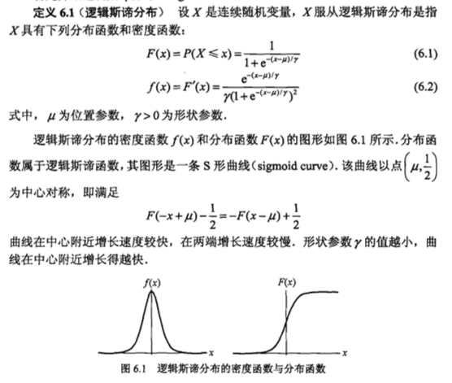
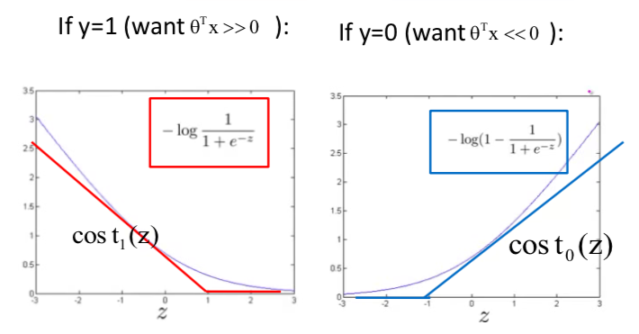
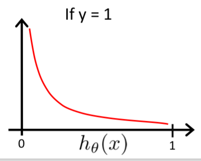
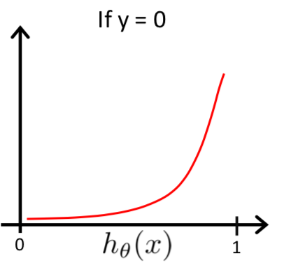
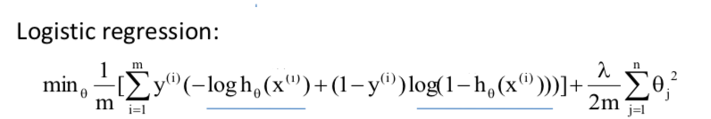
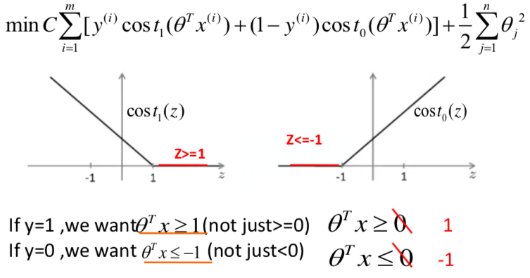

> SVM是一种线性分类方法，数据量少的时候效果相对较好
>
> 线性模型选择经验：*对于数据量大的线性方法，其实效果是差不多的，区别在于是否算法能够并行化，是否可以做到实时处理*

## 1 逻辑回归回顾

### 1.1 logistic数学模型

逻辑回归的模型是S型曲线模型（sigmoid），所以一般使用的模型函数是$h(\theta^Tx) = \frac 1 {1+e^{\theta^Tx}}$

有时可以对$\theta^Tx$前面加个参数调整S形状。

> 为什么叫logistic？
>
> 摘自统计学习方法：
>
> 

### 1.2 损失函数

为了衡量模型的好坏我们需要提出一个**准则**，即loss模型对样本预测结果的**损失函数**

对某个样本(x_i, y_i)预测结果的效果判断 :

$$ \\ L(\theta) = \begin{cases} - log\ h_{\theta}(x_i) & \quad \text{if } y_i = 1\\ - log\ (1- h_{\theta}(x_i)) & \quad \text{if } y_i = 0 \end{cases} $$

合并形式：

$$ L(\theta) = - (y_i log\ h_{\theta}(x_i) + (1-y_i) log(1-h_{\theta}(x_i))) $$

> 损失函数为什么是取对数呢？
>
> 1. 从图形方面考虑是为了使得产生下面两种loss形状
>
> 
>
> 2. 符合最大熵模型中的一种极大似然估计的方法
>
> 
> $L(\theta) = \prod h(\theta^Tx_i)^{y_i} h(\theta^Tx_i)^{1-y_i}\\$
> $-log(L(\theta)) = -(y_0*log(h(\theta^Tx_0)) + (1-y_0)*log(h(\theta^Tx_0))+….)$
> 
>

## 2. SVM

### 2.1 SVM的损失函数

回顾logistic回归的损失函数的图像如下（这里应该是曲线的）

|  |  |
| ------------------------------ | ------------------------------ |
|                                |                                |

当在SVM的情况下的loss是：

可以看到一个是loss的输入不同，一个是$h(\theta^Tx)​$，一个是$\theta^Tx​$；另一个是$cost_0, cost_1​$的不同，logistic回归的loss是log函数的平滑曲线，SVM的loss函数是直的折线

> 折线表达式如何表示？$cost_1(z) = max\{0, \text {xxx}\}$
>
> 对loss形状的修改可以换成类似的其他函数，这样就可以开发成别的算法

### 2.2 SVM模型

>  SVM模型Loss表达式中各个式子的含义，推导出SVM模型的几何含义

- $min \frac 1 2 \theta^2$ 这是$\theta$的模的平方

- 模型目标

  $$\begin{cases}\theta^Tx^{(i)} \ge 1 & \quad \text {if } y^{(i)} = 1 \\ \theta^Tx^{(i)} \le -1 & \quad \text {if } y^{(i)} = 0 \end{cases} $$

  ​

- 这里的$\theta^Tx^{(i)}$ 可以看做是$x$向量在$\theta$向量上面的投影与$\theta$的模的乘积，而这里的$\theta$就当作支持向量机里面超平面的法向量（超平面就是将样本安照标签分类的平面）

- 其他特点：假设$x$在$\theta$上面的投影是$p$，则$\theta^Tx^{(i)} = ||\theta||p$，则这个投影$p$可以视作到超平面的距离，所以说为了使得样本里超平面最小距离最大（$max(min(p_i))$），所以式子中的$||\theta||$要足够的小，越小则这个距离越大，反之则距离越小（不符合支持向量机要求的margin尽量大的要求）。所以要加入$min \frac 1 2 \theta^2$ ，限制$\theta$的值尽可能小（也属于正则项），如果没有这个正则项，可能会得到margin比较小的但又能分类的模型（margin小的模型的泛化能力不好）。

- 通过上面的分析，我们可以看到SVM的几何含义就是：找出一个超平面使得将样本点按照标签分类，同时使得离超平面最近的样本点的距离最远（margin足够大）。