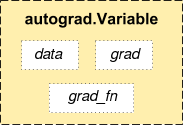

# Pytorch学习笔记

## 1. 基本数据类型

1. **torch.Tensor**

类似tensorflow，基本数据类型是torch.Tensor，内部支持不同维度、基本类型的张量。

- 支持操作
  - 支持基本的算术运算操作
  - numpy相互转换
  - 调用cuda（GPU）


## 2. 梯度库

1. **autograd**

用于自动计算关于Tensor算术过程中的各个梯度，是pytorch的核心库

2. **autograd.Variable**



- data
  - 变量中的数据：torch.Variable
- grad
  - 当前变量对某个之前变量算得的梯度
- grad_fn
  - 指向当前变量产生时所操作的函数记录，用于向前回溯找一系列操作过程
  - 猜测：每次Tensor的变量操作会保留一个运算地址（地址里面有输入、输出、操作方法）

3. **autograd.Variable.backward()**

> 当前变量是通过一系列的Tensor操作产生的，过程中有许多变量参与，许多变量产生
>
> 可以看做一系列Tensor操作的最终结果，当前变量当作子变量，之前参与操作变量可以看做父变量，更之前的看作是祖先变量（父变量相对于子变量而言是输入，子变量相当于输出：祖先变量—$f_{运算}$—>父变量—$f_{运算}$—>子变量）

- backward()发生了什么
  - backward()则是回溯这一系列操作，通过grad_fn依次寻找产生这个变量的父变量、祖先变量，并通过求导，求得当前子变量对父变量的导数，求子变量对祖先变量的导数（用链式法则），这个导数存储在对应的父变量、祖先变量的gra的中
  - 在求完自变量梯度后回溯过去的
- grad包含啥
  - *父变量1*的grad：$\frac {dy_{子变量}} {dx_{父变量1}}$
  - *祖先变量1*的grad：$\frac {dy_{子变量}} {dx_{祖先变量1}}$


## 3. 网络搭建库

>  torch.nn库是用于pytorch网络的搭建

1. **torch.nn.Module**

网络类型的基本父类，一般继承该类，搭建自己的网络类型

可以方便的通过Module.parameters()，在循环中访问网络中的权重变量

2. **nn.* 网络变量类型**

通过nn可以生成许多网络相关的操作算子，如：卷积核，全连接权重，池化

这些算子包括自带的数据权重（通过parameters()访问），和特定的操作函数

- nn.Linear
  - 线性权重算子：初始化权重尺寸，当输入匹配大小的数据，即可进行全连接运算
- nn.Conv2d
  - 二维卷积算子：初始化卷积核尺寸，卷积形式（padding，stride），当输入匹配大小数据，及可卷积操作
- nn.MaxPool2d
  - 二维池化算子：初始化池化尺寸，池化形式（padding，stride），输入匹配大小数据，即可池化
- nn.MSELoss
  - 平均平方差损失算子：计算loss

>  所有算子实例的操作都是输入一个autograd变量，输出一个autograd变量
>
> 支持batch数据输入

3. torch.optim自动优化权值

- optim.SGD注册返回优化器（初始化优化器变量以及学习率）
- optim.SGD.zero_grad()清空变量梯度
- optim.SGD.step()执行优化

官网实例：

```python
import torch
from torch.autograd import Variable
import torch.nn as nn
import torch.nn.functional as F


class Net(nn.Module):

    def __init__(self):
        super(Net, self).__init__()
        # 1 input image channel, 6 output channels, 5x5 square convolution
        # kernel
        self.conv1 = nn.Conv2d(1, 6, 5)
        self.conv2 = nn.Conv2d(6, 16, 5)
        # an affine operation: y = Wx + b
        self.fc1 = nn.Linear(16 * 5 * 5, 120)
        self.fc2 = nn.Linear(120, 84)
        self.fc3 = nn.Linear(84, 10)

    def forward(self, x):
        # Max pooling over a (2, 2) window
        x = F.max_pool2d(F.relu(self.conv1(x)), (2, 2))
        # If the size is a square you can only specify a single number
        x = F.max_pool2d(F.relu(self.conv2(x)), 2)
        x = x.view(-1, self.num_flat_features(x))
        x = F.relu(self.fc1(x))
        x = F.relu(self.fc2(x))
        x = self.fc3(x)
        return x

    def num_flat_features(self, x):
        size = x.size()[1:]  # all dimensions except the batch dimension
        num_features = 1
        for s in size:
            num_features *= s
        return num_features


net = Net()
print(net)
```

—未完待续—

