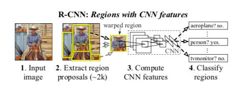
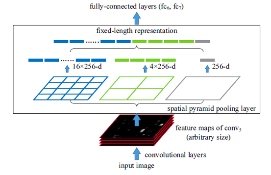
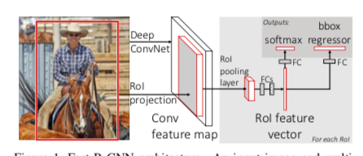
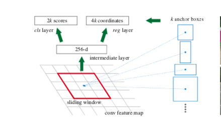

> R-CNN的提出是开创性的，它是第一次结合了神经网络的算法在图像检测中得到应用
>
> 这里我打算将我所理解的图像检测的神经网络发展脉络做个总结，顺便理清一下我的头绪

## 1. 图像检测

与图像识别问题不同，图像检测问题需要将目标在原图像中的位置识别出来，再做对目标的图像识别。

可以说是加入了目标位置检测的图像识别

## 2. R-CNN

> Regions with CNN features

### 2.1 基本架构图

### 2.2 基本结构分成三个模块

- Region Proposal
  - 概念：从原图像中提取目标可能的存在的候选区域
  - 在这篇文章中使用的是传统的Selective Searching算法（具体我也没有深究）
- 图像特征提取
  - 通过一个多层卷积网络提取图像的特征，为下个模块提供图像的特征输入
- SVM分类器
  - 从上个模块中得到的图像特征再做图像的分类，通过支持向量机的算法做分类学习

### 2.3 总结

1. Selective Searching的方法是传统的方法，其中只能在CPU中使用，计算复杂度高
2. 对于在最后使用SVM做分类器我不是很懂，本来可以直接在网络中训练分类，可是却没有这样

## 3. SPPnet

> SPPnet，全称Sptial Pyramid Pooling Net；下面摘自：http://www.cnblogs.com/rocbomb/p/4428946.html
>
> 
>
> *SPP的思想来源于SPM，然后SPM的思想来源自BoW。*
>
> *关于BoW和SPM，找到了两篇相关的博文，就不在这里展开了。*
>
> [第九章三续：SIFT算法的应用—目标识别之Bag-of-words模型](http://blog.csdn.net/v_JULY_v/article/details/6555899)
>
> [Spatial Pyramid 小结](http://blog.csdn.net/jwh_bupt/article/details/9625469)

**R-CNN待解决问题：**R-CNN在Region Proposal中得到的那些Proposals区域大小规格不同，需要在warp或者是crop操作，对于图像的信息有一点影响，导致图像的信息缺失，或者变异

**SPP层：**为了解决上面的问题SPP提出了SPP池化层，通过对conv5得到的feature map做统一规格的池化操作，最终可以得到大小一样的输出（主要是因为卷积层对统一大小没有要求，只有在全连接层才会有要求，所以需要在卷积层之后做统一规格的pooling）。

**金字塔：**SPP之所以叫金字塔，是因为对conv5的feature map做的是多个尺度的规格化pooling（如下图），任意的输入得到的都是：4x4, 2x2, 1x1大小的feature map。

>  SPP后续操作都是和R-CNN一致

**问题**：

1. 无法同时调参tuning卷积层和全连接层
2. 需要做SVM，之后额外做bounding box Regressor

## 4. Fast R-CNN

### 4.1 基本架构图

### 4.2 基本模块

- Region Proposal
  - 第一部分基本还是用老生常谈的ss，除去考虑这个模块，Fast R-CNN基本实现了端到端的思想（end-to-end）
- CNN分类器+Bounding Box Regressor
  - conv feature map：将整个图像输入多个卷积层+池化层得到卷积层输出的特征图
  - fixed-length feature：求到原图的proposals区域在conv feature map中的映射位置，输入到RoI pooling layer，使得输出固定大小
  - RoI feature vector：将上面固定大小的特征输入多个全连接层，得到特征向量
  - sibling output layers：
    - outputs layers：输出对应区域在各个类别的检测概率
    - bbox regressor：输出对应区域学习优化的框的大小（用于调整bounding box的尺寸和位置）
- Multi-task loss
  - output layer的loss
  - bbox regressor的loss

### 4.3 总结

1. 改进R-CNN和SPPnet中的缺陷
   - R-CNN和SPPnet的多阶段处理问题
   - 时间空间开销大的问题
   - 图像检测太慢
   - 取消了SVM分类器，用网络代替
2. 贡献：
   - 训练是单阶段的
   - 提出了Bounding Box Regressor提高Region Proposal的精度

## 5. Faster R-CNN

> Fast R-CNN中仍有的问题：Region Proposal阶段仍旧用的是传统方法，使用的是CPU，计算速度慢

### 5.1 RPN

> Region Proprosol Network：
>
> Faster R-CNN提出了RPN网络的概念为的是将Regon Proposal融入网络，使得真正做到端到端的检测模型

#### 5.1.1 基本架构图

#### 5.1.2 机制

>  RPN所需要解决的就是提出有物体的区域的大致位置，位置的矫正可以在后面通过Bounding Box Regressor实现

**目标**：就是输入一张图片，输出图片中含有物体的区域位置（x，y，w，h）

​	RPN层是全连接网络，输入的获取是通过一个nxn的sliding window在conv feature map上取值（conv feature map是通过多层卷积层的结果，如：VGG，ZFNet），feature map的像素点要作为sliding window的中心做一次RPN操作。

​	sliding window中的值通过一个全连接层得到一维向量，一维向量再在两个并行的全连接网络（sibling layer），一个是cls layer，另一个是reg layer；

​	这个sliding window的中心可以映射回原图的区域，得到原图的对应区域（anchor）的中心点，而我们以这个中心为固定点，设定几个固定尺度，固定缩放的区域，这样一个conv feature map的点可以映射回去多个区域（anchor）；这里我们假定是k个anchors，那对于cls layer 就有2k个输出，代表（有物体/没有物体）的得分，reg layer就有4k个输出（代表有物体的区域的对应位置）。

> anchor 👇

​	训练好RPN后就能，将提取的proposals用到Fast R-CNN中，进行分类和bbox regressor；其实这里Fast R-CNN需要和RPN网络是共享特征的，即输入的特征来自一个卷积网络的特征提取；那么这样子多个loss如何训练呢，这里需要一定的训练技巧：轮流训练，联合训练（由于我没有操作经验，这里没有细说）

> References:
>
> [论文笔记 《Fast R-CNN》](https://blog.csdn.net/u010678153/article/details/46891655)
>
> [【目标检测】Faster RCNN算法详解 ]( https://blog.csdn.net/shenxiaolu1984/article/details/51152614)
>
> [rcnn spp_net](http://www.cnblogs.com/rocbomb/p/4428946.html)
>
> [你应该知道的9篇深度学习论文（CNNs 理解）](https://blog.csdn.net/feimengjuan/article/details/69666981)
>
> [分类以及目标检测发展脉络——从12到17](https://blog.csdn.net/wangqingbaidu/article/details/79280212)

