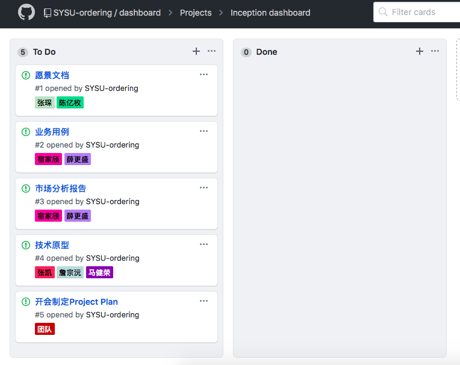

## 1. 简答题

### 1.1 简述瀑布模型、增量模型、螺旋模型（含原型方法）的优缺点。

| 模型                   | 优点                                                         | 缺点                                                         |
| ---------------------- | ------------------------------------------------------------ | ------------------------------------------------------------ |
| 瀑布模型               | - 定义软件开发基本流程与活动 - 降低软件开发的复杂程度，提供软件开发过程的透明性，提供软件开发过程的可管理性 - 推迟软件实现，强调软件实现前必须进行分析和设计工作 - 以项目的阶段评审和文档控制为手段有效的对整个开发过程进行指导，保证了阶段之间的正确衔接，能够及时发现并纠正开发过程中存在的缺陷，使产品达到预期的质量要求 | - 依赖问题：前面需求模糊，后面工作出现问题 - 容错问题：在后期发现需求问题，工作量难以接受 - 资源调配问题：只是技能需求不同，人员数量要求不同 - 强调过程活动的线性顺序 - 缺乏灵活性，特别是无法解决软件需求不明确或不准确的问题 - 风险控制能力弱 - 瀑布模型中的软件活动是文档驱动的，当阶段之间规定过多的文档是，会极大增加系统工作量 - 管理人员如果仅仅以文档的完成情况来评估项目的完成进度，往往会产生错误的结论 |
| 增量模型               | - 增强客户对系统的信心 - 降低系统失败风险 - 提高系统可靠性 - 提高系统稳定性和可维护性 | - 增量粒度难以选择 - 确定所有的基本业务服务比较困难       |
| 螺旋模型（含原型方法） | - 可以很好地接受需求的改变 - 使用和拓展原型方法 - 需求可以被更准确的分析 - 使用者可以很早看到系统的原型，以此做出早期的评估 - 开发过程可以被分为很小的部分，风险在早期做出评估，达到更好的风险管理 | - 管理过程是复杂的 - 项目的结束难以预估 - 不太适合小项目 - 风险分析需要相当的成本耗费，只适合投资较大的规模软件项目 - 大量的中间阶段产生大量的文档 - 失误的风险分析可能带来更大的风险 |

 

### 1.2 简述 UP 的三大特点，其中哪些内容体现了用户驱动的开发，哪些内容体现风险驱动的开发？

| 三大特点       | 1. 迭代增量的（Iterative and Evolutionary）：         工程初始阶段的知识是不完全的，不全面的。这种方式的优点在于：在初始阶段后逐步趋向稳定；有效的管理需求的变换；持续集成；尽早接触整个系统；在线风险评估 2. 架构为中心的（Architecture Centric）：         架构讨论关于软件系统总体结构、结构元素之间的接口、结构元素之间的合作以及他们的行为来表示。架构为中心指的是围绕某个软件架构为中心进行开发，架构为中心勾勒出了一系统概貌，提供一套成熟的有组织的框架使用，有利于重用 3. 案例驱动的（Use Case Driven）：         案例是指，一个时期被分为一系列动作，一个动作同时有很多个参与者参与，这些动作的共同结果是可视化的，帮助参与者更好的达到他们的目标。案例驱动指，开发团队的开发，从需求分析到编码和测试都是应用案例的方法 |
| -------------- | ------------------------------------------------------------ |
| 用户驱动的开发 | 案例驱动开发：通过案例的方法，使得每个阶段的内容可视化，有助于协调用户明确需求 迭代增量的开发：尽早接触整个系统，使得成功可以看见 |
| 风险驱动的开发 | 迭代增量的开发：有助于风险评估 架构为中心开发：使用现有的开发架构有利于降低风险性，提高开发效率 |

 

### 1.3 UP 四个阶段的划分准则是什么？关键的里程碑是什么？

四个阶段的划分准则是：依据各个阶段能达到的成果或者是目标

| 阶段                     | 成果或目标                                                   | 里程碑                                                       |
| ------------------------ | ------------------------------------------------------------ | ------------------------------------------------------------ |
| 初始阶段（Inception）    | 1. 为系统建立**业务案例**，确定**项目边界** **- 业务案例**：项目验收规范、风险评估、所需资源估计、阶段计划 **- 确定项目边界**：识别所以与系统交互的外部实体、定义外部是体育系统的交互特性（识别外部角色、识别所以用力并详细描述一些重要的用例） | （生命周期目标里程碑的相关文档） 1. **项目构想文档** 2. **原型用例模型** 3. **原始业务风险评估** 4. **一个或者多个原型** 5. **原始业务案例** |
| 精化阶段（Elaboration）  | 1. **分析问题领域** 2. **建立健全的体系结构基础** 3. **编制项目计划** 4. **完成项目中高风险需求部分的开发** | （生命周期体系结构里程碑） 1. **风险分析文档** 2. **软件体系结构基准** 3. **项目计划** 4. **可执行的进化原型** 5. **初始版本的用户手册** |
| 构建阶段（Construction） | 1. **完成所有剩余的技术构件** 2. **稳定业务需求功能的开发** 3. **集成为产品** 4. **详细测试所有功能** | （执行功能里程碑） 1. **可运行的软件产品** 2. **用户手册** |
| 交付阶段（Transition）   | 1. 确保软件对最终用户是可用的 - **为发布准备的产品测试** - **基于用户反馈的少量调整** | （产品发布里程碑）                                           |

 

### 1.4 IT 项目管理中，“工期、质量、范围/内容” 三个元素中，在合同固定条件下，为什么说“范围/内容”是项目团队是易于控制的

“范围/内容”的控制与项目管理中的要素成本的控制有关，范围/内容越大所需工程成本越高，而在合同固定的条件下，合同不能随意更改，说明工程项目的客户需求是固定的，对于项目的开发而言代表项目前期的需求确定，以及甲方提供成本是确定的。

所以对于有经验的项目团队，由于过往项目的完成经验，可以根据合同需求，以及成本，分析项目合理的范围。所以，这对于项目团队是易于控制的。

 

### 1.5 为什么说，UP 为企业按固定节奏生产、固定周期发布软件产品提供了依据？

UP的软件生命周期从时间上分为四个阶段，每个阶段包括一个主要的里程碑。阶段是两个主要里程碑的分隔，在各个阶段结束时，执行评估阶段目标是否满足以决定是否进入下一个阶段。因此RUP提供了固定节奏的生产。 
UP是一个风险驱动的生命周期模型，为了有效地控制风险，UP以渐进的方式进行演进，首先解决高风险的问题，这主要是通过迭代来实现。在软件生命周期中，每个阶段可以划分为多个迭代，每个迭代确定一个内部里程碑（或一个发布）。因此，UP也为固定周期发布软件产品提供了依据。

 

## 2. 项目管理使用

- 使用截图工具（png格式输出），展现你团队的任务 Kanban，请注意以下要求
  - 每个人的任务是明确的。即一周后可以看到具体成果
  - 每个人的任务是1-2项。
  - 至少包含一个团队活动任务

Our Kanban

